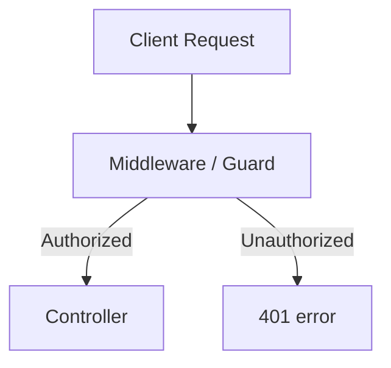

# Documentation Style Guide

This guide defines the writing, layout, and visual standards for the documentation of this project.

## Tone and Voice

- **Clear and Direct**: Use active voice ("Run this command" rather than "This command should be run").
- **Concise**: Avoid fluff and long preambles. Get straight to the value or task.
- **Developer-Friendly**: Professional but accessible. Avoid overly formal or archaic language.
- **Gender-Neutral**: Use "they/them" or restructure sentences to avoid gendered pronouns.

## Typography and Markdown

- **Headings**: Use sentence case for headings. Use a single `#` heading per document for the main title. Follow a strict nested hierarchy: `#` -> `##` -> `###` -> `####`. Do not skip heading levels.
- **UI Elements**: Bold user interface buttons, menus, and field names (e.g., "Click the **Save Settings** button").
- **Code, Files, & Commands**: Use inline code block backticks for variables, functions, API paths, ports, files, and terminal commands (e.g., `GET /v1/users`, `index.js`, port `8080`, `npm install`).
- **File Links**: Create clickable links for referenced files. Avoid surrounding link text with backticks.
  - **Correct**: Refer to [config.json](file:///path/to/config.json).
  - **Incorrect**: Refer to [`config.json`](file:///path/to/config.json).

## Alert Callouts (GitHub Flavored Markdown)

Use alerts to emphasize critical information. Do not stack them or nest them.

```markdown
> [!NOTE]
> Use for additional context, tips, and optional explanations.

> [!IMPORTANT]
> Use for critical prerequisites or steps that must be followed.

> [!WARNING]
> Use for actions that could break things, cause compilation issues, or require special precautions.

> [!CAUTION]
> Use for actions that could cause data loss, security vulnerabilities, or infrastructure failure.
```

## Diagrams (Mermaid.js)

For workflows, data flows, and component relationships, use Mermaid.js diagrams.
Rules:
1. Always wrap Mermaid code in a fenced block: ` ```mermaid `
2. Use clear node names and quote labels containing special characters: `A["Node (Detail)"]`
3. Keep diagrams simple and readable. Do not build huge, unreadable flowcharts.
4. Avoid HTML tags within node labels.

Example:


## Code Snippets

- **Syntax Highlighting**: Always specify the language name after the three backticks (e.g., `python`, `javascript`, `bash`, `yaml`).
- **Ellipses**: Use comment ellipses (e.g., `// ...` or `# ...`) to skip boilerplate and focus on the relevant part of the code.
- **Environment variables**: Use descriptive placeholders enclosed in angle brackets or prefixed with standard names (e.g., `<DATABASE_URL>`, `YOUR_API_KEY`).
